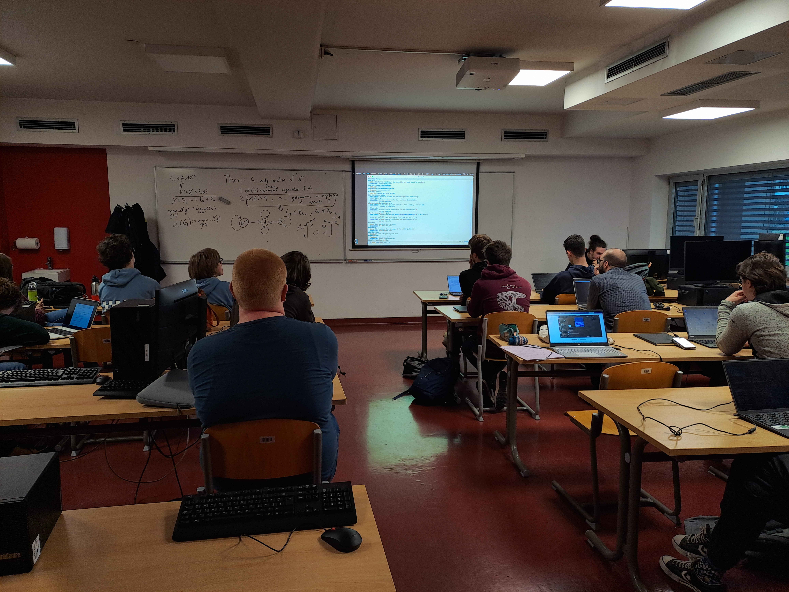

Klasična Emacs fora je, da je le-ta dober operacijski sistem, a da mu manjka le dober urejevalnik teksta.
V delavnici bomo videli, da je prvi del šale resničen, drugi pa neresničen.

Za razliko od Unix sistemov, ki so grajeni okoli cevovodov (pipes) in povezujejo programe na nivoju
vhodov in izhodov, lispov model temelji na konstantnem in kibernetičnem dostopu do vseh funkcij programov,
njihove izvorne kode in vse dokumentacije.
GNU Emacs je zgrajen na istem modelu.

Videli bomo tudi, da je Emacs več kot zmogljiv urejevalnik teksta, tako s svojimi vgrajenimi funkcijami,
kot z vsemi možnimi paketi, ki ga izboljšajo.
Kot majhno posledico bomo videli, da je Emacs najboljša implementacija modalnega urejevalnika (neo)vi(m).

Delavnica je primerna za začetnike in bo primarno vsebovala stvari,
ki bi si jih vsak Emacs uporabnik želel vedeti ob začetku (in jih ponavadi izve šele po nekaj letih).
Tisti, ki želijo sodelovati, naj si namestijo Emacs verzijo vsaj 30 ter sistem git (za kloniranje datotek za delavnico).

